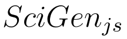

[](https://www.npmjs.com/package/scigen)
[](https://github.com/davidpomerenke/scigen.js/actions?query=workflow%3A%22Node+CI%22)
[](https://gitter.im/scigen-js/community?utm_source=badge&utm_medium=badge&utm_campaign=pr-badge)

This project brings [SciGen](https://pdos.csail.mit.edu/archive/scigen/) to JavaScript, both for Node and for the browser.

[Try it here!](https://davidpomerenke.github.io/scigen.js)

## Usage

### Node
```javascript
import { scigen, scigenSave } from 'scigen'

const files = scigen(
  /* authors = */ ['Jeremy Stribling', 'Max Krohn', 'Dan Aguayo'], 
  /* avoid bibtex dependency = */ false)
console.log(files['paper.tex'])

scigenSave(
  /* directory = */ 'mydir', 
  /* authors = */ undefined, 
  /* avoid bibtex dependency = */ true)
```

### Command Line
```bash
$ git clone git@github.com:davidpomerenke/scigen.js && cd scigen
$ node lib/cli.js --help
Usage: node cli.js --save [<directory>] [--authors "<author1>, <author2>, ..."] [--bibinlatex] [--silent]
    directory   all files (.tex, .eps, .cls, .bib, ...) will be saved here
    authors     list of the authors in the paper
    bibinlatex  avoids dependency on BibTex (useful especially for texlive.js)
    silent      skip info logging
$ node cli.js --save tmp --authors "Jeremy Stribling, Max Krohn, Dan Aguayo" --silent
$ cd tmp
$ pdflatex -interaction=nonstopmode paper.tex 
$ bibtex paper.aux
$ pdflatex -interaction=nonstopmode paper.tex
$ pdflatex -interaction=nonstopmode paper.tex
$ xdg-open paper.pdf
```

### Browser
```bash
$ git clone git@github.com:davidpomerenke/scigen.js && cd scigen
$ npx webpack
$ python -m http.server -d docs
$ xdg-open http://localhost:8000
```

See also the [TexLive.js Wiki](https://github.com/manuels/texlive.js/wiki).

## Rule Compilation
The almost original rule files from the [original SciGen project](https://github.com/strib/scigen) are found in `rules/rules-original`. They can be compiled to JSON by running `perl rules/compile-rules.pl`. The JSON files are required for running the module. They are already included in the module and only need to be re-compiled for applying changes in the original `.in` rule files.

## Structure
- `src` includes the main source code, written in _ES2016_.
- `lib` is a transpilation of this source code to standard JavaScript. Use this for running and importing the module locally. It is also the code for the _NPM_ module.
- `rules` includes the context-free grammar to create the papers:
  - `rules/rules-original` contains the `.in` rules from the [original SciGen project](https://github.com/strib/scigen), only very slightly modified.
  - `rules/rules-compiled` contains the rules compiled to _JSON_. They can be compiled to JSON by running `perl rules/compile-rules.pl`. The JSON files are required for running the module.
- `docs` does not contain the documentation but a working example of using the module in the browser. It uses [TexLive.js](https://github.com/manuels/texlive.js).
  - `docs/bundle.js` is the browser code for the module. It is created from the `src` directory by running `npx webpack`.
  - `docs/precompiled-figures` is a dirty workaround for the figures (see _limitations_).

## Limitations
- Bibtex is not available for the browser (cf. [here](https://github.com/manuels/texlive.js/issues/7)). An almost perfect workaround is implemented for the parameter `--bibinlatex` (or setting the second/third function parameter to `true` in Node, see the above examples).
- Rendering diagrams and figures requires _Ghostscript_ in the [original SciGen project](https://github.com/strib/scigen). _Ghostscript_ is not available for the browser. 
  - A good workaround would probably involve rewriting the original EPS rules in some format which is supported by _TexLive.js_ (maybe SVG or TIKZ). As this module is aimed at the browser, the diagram and figure code production is not yet implemented in the JavaScript code.
  - A current, bad workaround is implemented in `docs/index.html`, where some out of 50 pre-compiled figures are loaded from `docs/precompiled-figures`. However, for an obscure reason Latex treats the diagrams differently than the other figures and layouts them in a very weird way. So diagrams are currently left out completely, which is very unsatisfactory.
  -  For locally producing TEX and PDF files with figures and diagrams, use the [original SciGen project](https://github.com/strib/scigen) with [this unmerged fix](https://github.com/strib/scigen/pull/5) or run `git clone git@github.com:davidpomerenke/scigen.js && cd scigen/scigen-perl && perl make-latex.pl`.
- Works in Firefox Desktop & Mobile and in Chrome Mobile, but not in Chrome/Chromium Desktop. Cf. [this issue with TexLive.js](https://github.com/manuels/texlive.js/issues/63).

## Motivation
The server-side code at the [original SciGen website](https://pdos.csail.mit.edu/archive/scigen/) appears to be broken. The aim of this project is therefore to provide a more server-independent implementation.

## Also interesting
Here's an interesting paper on the topic of scientific fake text generators. 

- Guillaume Cabanac, Cyril Labbé, Alexander Magazinov. _Tortured phrases: A dubious writing style emerging in science. Evidence of critical issues affecting established journals._ 2021. [[arXiv]](https://arxiv.org/abs/2107.06751)
